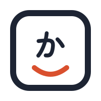
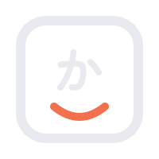
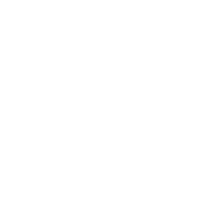
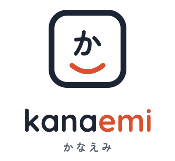
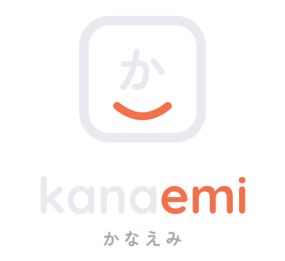
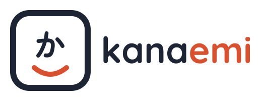
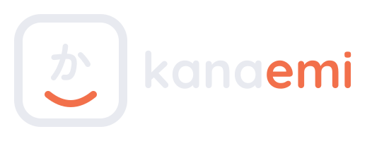

# kanaemi-brand

[English](README.md) | 日本語

Kanaemi のロゴと、その使い方の決まり。

Kanaemi の名前とロゴは、オープンソースのライセンスではない。使ってよい場面は [Kanaemi 商標ポリシー](TRADEMARKS.ja.md) が決める。要するに、Kanaemi そのものを指すためには使えるが、ほかのものの名前や看板には使えない。この文書は、ロゴそのものと表示のしかたを説明する。日本語版の文書はどれも翻訳で、英語版が優先する。

## ロゴ

ロゴは、キーキャップに「か」と笑みの弧を入れたシンボルと、「kanaemi」のワードマークでできている。元になるのは `logo/` の SVG で、`png/` にはそれぞれを背景が透明な PNG にいくつかの大きさで書き出したものを `<名前>-<幅>x<高さ>.png` として置いてある。PNG は `scripts/png.sh` が SVG から作る。

### 意味

- キーキャップ：入力のための道具であること。どの OS のキーボードにも共通する形で、OS を選ばないことも表す。
- 「か」：名前の前半、kana（かな）。
- 笑みの弧：名前の後半、emi（笑み）。emi を逆から読むと ime になる。

ワードマークは「kana」と「emi」を色分けし、名前が 2 つの部分からできていることを示す。

### 種類

| 種類                   | ライト | ダーク | 単色（黒） | 単色（白） | 用途 |
| ---------------------- | ------ | ------ | ---------- | ---------- | ---- |
| シンボル（通常版）     |  |  |  |  | 32px 以上のアイコン |
| シンボル（小サイズ版） |  |  |  |  | 24px 以下のアイコン |
| 縦組みロゴ             |  |  | — | — | 表紙 |
| 横組みロゴ             |  |  | — | — | ヘッダー、バナー |

### 色

| 要素                   | ライト  | ダーク  |
| ---------------------- | ------- | ------- |
| キーの枠、「か」、kana | #1D2433 | #E8EAF0 |
| 笑み、emi              | #D9502E | #F2704B |
| かなえみ（補助）       | #5A6272 | #A3AAB8 |

### 書体

書体はどちらも SIL Open Font License 1.1 で、ロゴの文字として使える。SVG の文字はアウトライン化してあるので、書体を入れていない環境でも同じ形で表示される。

| 要素               | 書体                                                                           |
| ------------------ | ------------------------------------------------------------------------------ |
| kanaemi            | [Quicksand](https://github.com/google/fonts/tree/main/ofl/quicksand) Bold        |
| 「か」、かなえみ   | [Zen Maru Gothic](https://github.com/google/fonts/tree/main/ofl/zenmarugothic) Bold（小サイズ版の「か」は Black） |

## 表示するときの決まり

そもそもロゴを使ってよいかは [Kanaemi 商標ポリシー](TRADEMARKS.ja.md) が決める。使うときは、それに加えて次の決まりに従う。

- 24px 以下では小サイズ版を使う。通常版の細い線は、小さく表示すると潰れる。
- メニューバーのように単色のアイコンが慣例の場所では、単色版を使う。
- 縦横比を変えて伸縮させない。
- ここにない色に変えない。
- シンボルとワードマークの位置関係や比率を変えない。
